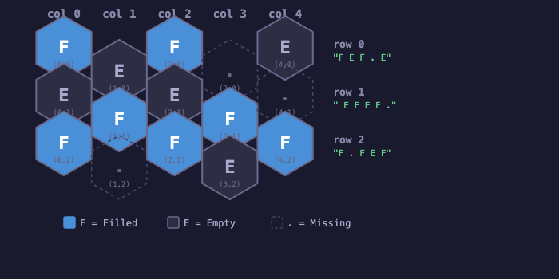
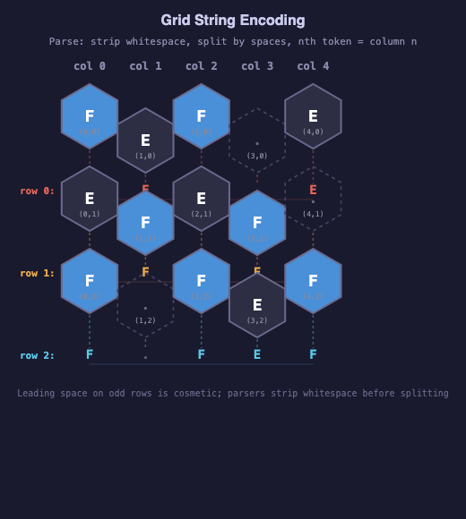

# Load & Save Game State — Design Spec

## Overview

Add save/load functionality to the 01-grid-mechanics test app. The save format is a stable, human-readable JSON contract independent of runtime implementation — designed to survive internal refactors, technology stack changes, and eventual migration to a production game.

The scope includes:
- A schema-first JSON save format covering puzzle definitions, player progress, and undo/redo history
- A per-clue contiguity refactor (prerequisite for the save format)
- A pluggable storage abstraction with localStorage and file export/import backends
- Mappers between runtime structures and the save format

## Save File Structure

A single `.json` file with four top-level fields:

```json
{
  "version": 1,
  "seed": null,
  "puzzle": { ... },
  "progress": null,
  "history": null
}
```

| Field | Type | Required | Description |
|-------|------|----------|-------------|
| `version` | integer | yes | Format version, always `1` for this spec |
| `seed` | integer \| null | no | RNG seed for puzzle regeneration (future use; null for now and for user-generated puzzles) |
| `puzzle` | object | yes | Puzzle definition — everything needed to set up a fresh game |
| `progress` | object \| null | no | Player's current state; null or absent means a fresh/unplayed puzzle |
| `history` | object \| null | no | Undo/redo action log; null or absent means empty undo stack |

A file with only `version` and `puzzle` is a clean puzzle definition — exactly what a puzzle generator would produce. A file with all fields populated is a game-in-progress.

## Puzzle Definition

The `puzzle` section captures everything needed to set up a fresh game board:

```json
{
  "puzzle": {
    "name": "Basic Neighbor Clues",
    "description": "Optional human-readable description",
    "grid": {
      "width": 3,
      "height": 3,
      "groundTruth": [
        "F . F",
        " E F ",
        ". E ."
      ],
      "initialReveals": [
        "_ . _",
        " O _ ",
        ". _ ."
      ]
    },
    "clues": {
      "neighbors": {
        "1,1": { "contiguity": true },
        "2,1": { "contiguity": false }
      },
      "flowers": {
        "0,0": { "visibility": "visible" },
        "1,0": { "visibility": "hidden" }
      },
      "lines": {
        "v:0,0": { "visibility": "visible", "contiguity": true },
        "a:1,2": { "visibility": "deleted", "contiguity": false }
      }
    }
  }
}
```

### Puzzle Fields

| Field | Type | Required | Description |
|-------|------|----------|-------------|
| `name` | string | yes | Human-readable puzzle name |
| `description` | string | no | Optional description |
| `grid` | object | yes | Grid shape and cell assignments |
| `grid.width` | integer | yes | Grid width in columns |
| `grid.height` | integer | yes | Grid height in rows |
| `grid.groundTruth` | string[] | yes | Grid string encoding ground truth (see Grid String Format) |
| `grid.initialReveals` | string[] | no | Grid string encoding which cells start revealed; null/absent means all covered |
| `clues` | object | no | Per-clue state overrides; null/absent means all defaults |

### Clue State

Clue entries use a sparse representation: only clues with non-default state need entries. A clue not listed gets defaults (contiguity on, visibility visible).

**Neighbor clues** — keyed by `"col,row"`:
| Field | Type | Default | Description |
|-------|------|---------|-------------|
| `contiguity` | boolean | true | Whether contiguity notation is shown |
| `visibility` | string | "visible" | One of: `"visible"`, `"hidden"`, `"deleted"` |

**Flower clues** — keyed by `"col,row"`:
| Field | Type | Default | Description |
|-------|------|---------|-------------|
| `visibility` | string | "visible" | One of: `"visible"`, `"hidden"`, `"deleted"` |

**Line clues** — keyed by `"axis:col,row"` where axis is `v` (vertical), `a` (ascending), or `d` (descending):
| Field | Type | Default | Description |
|-------|------|---------|-------------|
| `contiguity` | boolean | true | Whether contiguity notation is shown |
| `visibility` | string | "visible" | One of: `"visible"`, `"invisible"`, `"visible-with-line"`, `"dimmed"`, `"deleted"` |

**Deleted clues** are permanently absent from the puzzle — they are never shown and cannot be toggled by the player. This supports puzzle generation where unused clues are stripped.

Clue *values* are never stored — they are always recomputed from ground truth.

## Progress

The `progress` section captures the player's current state:

```json
{
  "progress": {
    "cells": [
      "C . M",
      " O C ",
      ". C ."
    ],
    "mistakes": 2,
    "remaining": 1,
    "clues": {
      "flowers": {
        "0,0": { "visibility": "dimmed" },
        "1,0": { "visibility": "guide" }
      },
      "lines": {
        "v:0,0": { "visibility": "visible-with-line" }
      }
    }
  }
}
```

### Progress Fields

| Field | Type | Description |
|-------|------|-------------|
| `cells` | string[] | Grid string encoding player-visible cell states (see Grid String Format) |
| `mistakes` | integer | Total mistakes made (persists even if corrected) |
| `remaining` | integer | Filled cells not yet marked |
| `clues` | object \| null | Player-modified clue visibility overrides |

**Cell state characters**: `C` = covered, `O` = open empty, `M` = marked filled, `.` = missing.

**Clue overrides** layer on top of puzzle clue definitions. On load: apply puzzle clue settings first, then apply progress overrides. This means a puzzle can hide a clue that the player cannot un-hide. The same sparse format applies — only non-default entries appear.

**Counters are stored explicitly** rather than recomputed, since `mistakes` reflects game history (a mistake that was later corrected still counts).

## History (Undo/Redo)

```json
{
  "history": {
    "actions": [
      { "type": "open", "coord": "1,1", "wasMistake": false },
      { "type": "mark", "coord": "0,0", "wasMistake": false },
      { "type": "toggleFlowerVisibility", "coord": "1,0", "from": "visible", "to": "dimmed" },
      { "type": "toggleLineVisibility", "key": "v:0,0", "from": "visible", "to": "visible-with-line" },
      { "type": "dev:recover", "coord": "0,0" },
      { "type": "dev:toggleTruth", "coord": "1,1" }
    ],
    "cursor": 4
  }
}
```

### History Fields

| Field | Type | Description |
|-------|------|-------------|
| `actions` | array | Ordered list of player/dev actions |
| `cursor` | integer | Index into actions: actions before cursor are applied, actions at/after cursor are available for redo |

### Action Types

**Player actions:**

| Type | Fields | Description |
|------|--------|-------------|
| `open` | `coord`, `wasMistake` | Reveal a covered cell (correct if empty, mistake if filled) |
| `mark` | `coord`, `wasMistake` | Mark a covered cell as filled (correct if filled, mistake if empty) |
| `toggleFlowerVisibility` | `coord`, `from`, `to` | Change flower clue visibility |
| `toggleLineVisibility` | `key`, `from`, `to` | Change line clue visibility |

**Developer actions** (namespaced with `dev:` prefix):

| Type | Fields | Description |
|------|--------|-------------|
| `dev:recover` | `coord` | Revert a revealed cell back to covered |
| `dev:toggleTruth` | `coord` | Flip ground truth between filled/empty |
| `dev:toggleMissing` | `coord` | Toggle whether a position has a cell |

Each action stores enough information to apply forward or reverse. Actions with `from`/`to` fields are self-reversing. Cell actions (`open`, `mark`) include `wasMistake` so undo can correctly adjust the mistake counter without needing to consult ground truth. Undoing `open` or `mark` restores the cell to `covered`.

The history section can be omitted or null to load with an empty undo stack — this is the opt-out path if serialization size becomes a performance concern.

## Grid String Format

Grid strings are a compact, human-readable encoding of hex grid contents. Each row of the grid becomes one string in the array, read top-to-bottom.

### Hex Grid Layout

The game uses a flat-top, offset-column hex layout. Even columns (0, 2, 4, ...) sit higher; odd columns (1, 3, 5, ...) are shifted down by half a cell height. Columns alternate vertical position, but all cells at the same `row` index map to the same grid string line.



### Encoding Rules

Each grid string row encodes one row of hex cells, left-to-right by column.

**Character meanings depend on context:**

For `groundTruth` strings:
- `F` = filled cell
- `E` = empty cell
- `.` = missing (no cell at this position)

For `initialReveals` strings:
- `_` = covered (not yet revealed)
- `O` = open (revealed as empty)
- `M` = marked (revealed as filled)
- `.` = missing

For `cells` (progress) strings:
- `C` = covered
- `O` = open empty
- `M` = marked filled
- `.` = missing

**Spacing**: cell characters are separated by spaces to align columns visually. Odd-indexed rows (row 1, 3, 5, ...) are indented by one leading space to visually suggest the hex column offset.

### Worked Example

A 5-wide, 3-tall grid with this ground truth:

```
col:  0  1  2  3  4
row 0: F  E  F  .  E
row 1: E  F  E  F  .
row 2: F  .  F  E  F
```

Encodes as:

```json
"groundTruth": [
  "F E F . E",
  " E F E F .",
  "F . F E F"
]
```

**Reading the encoding**:

- Row 0 (`"F E F . E"`): starts at column 0 (even row, no indent). Characters at positions: `F`(col0) `E`(col1) `F`(col2) `.`(col3, missing) `E`(col4).
- Row 1 (`" E F E F ."`): starts with a leading space (odd visual offset). Characters: `E`(col0) `F`(col1) `E`(col2) `F`(col3) `.`(col4, missing).
- Row 2 (`"F . F E F"`): no indent. Characters: `F`(col0) `.`(col1, missing) `F`(col2) `E`(col3) `F`(col4).

**Parsing rule**: strip leading/trailing whitespace, split by spaces. The nth token is column n. A `.` means no cell exists at that position.

**Note on indentation**: the leading space on odd rows is purely cosmetic — it visually suggests the hex offset but has no semantic meaning. Parsers should trim whitespace before splitting.

### Visual Encoding Mapping

This diagram shows how each token in a grid string maps to its corresponding hex cell, with dashed lines connecting tokens to their positions:



## Per-Clue Contiguity Refactor

This is a prerequisite runtime change before serialization can be implemented.

### Current State

Two global booleans in `clueOptions`:
- `contiguityEnabled` — controls all neighbor clue notation
- `lineContiguityEnabled` — controls all line clue notation

### New State

Per-clue contiguity:
- Each neighbor clue gets a `contiguityEnabled: boolean` on `HexCell`
- Each line clue gets a `contiguityEnabled: boolean` on `LineClue`
- The render pipeline reads per-clue state instead of global flags
- Flower clues are unaffected (no contiguity notation)

### Global Toggles Become Bulk Operations

The existing UI checkboxes remain, but change behavior:
- "Toggle neighbor contiguity" iterates all neighbor clues and flips each one
- "Toggle line contiguity" iterates all line clues and flips each one
- Individual per-clue toggling is not exposed in UI for this iteration (but the state supports it for puzzle generation)

## Storage Abstraction

### Interface

```typescript
interface SaveStorage {
  save(key: string, data: string): Promise<void>;
  load(key: string): Promise<string | null>;
  list(): Promise<string[]>;
  delete(key: string): Promise<void>;
}
```

- `key` — save slot identifier (filename or localStorage key)
- `data` — serialized JSON string
- Mapper layer is independent of storage: it produces/consumes plain objects, which are stringified before hitting storage

### Backends

**localStorage** — default for auto-save and quick resume.

**File export/import** — browser file picker for download (save) and upload (load). Produces/consumes `.json` files.

### UI Surface

- **Save button** — writes to localStorage auto-slot + offers file download
- **Load button** — choose from localStorage slots or upload a file
- **Clear button** — wipes all localStorage save data, with a confirmation prompt ("Are you sure? This cannot be undone.")

Popup-based slot management (rename, browse, delete individual slots) is deferred to a future iteration.

## Design Decisions

1. **Schema-first format** — the save format is a stable contract, not a serialization of runtime internals. Internal refactors do not break save files.

2. **Sparse clue representation** — only non-default clue states are stored. This keeps files small, human-readable, and focused on designer/player intent.

3. **Clue values are never stored** — always recomputed from ground truth. This avoids stale data and keeps the puzzle definition minimal.

4. **Layered clue state** — puzzle defines base clue state, progress overlays player modifications. Clear ownership of each setting.

5. **Action log for history, not state snapshots** — compact, supports opt-out by omission, and records the player's journey.

6. **Dev actions namespaced** — `dev:` prefix makes it trivial to filter or strip developer actions from player-facing saves.

7. **Pluggable storage** — thin async interface decouples save format from storage mechanism. Supports migration from browser to native app or cloud.

8. **Counters stored explicitly** — `mistakes` and `remaining` reflect game history, not just current board state.

9. **Deleted clues** — `"deleted"` visibility state supports puzzle generation stripping unused clues, distinct from `"hidden"` or `"invisible"`.
